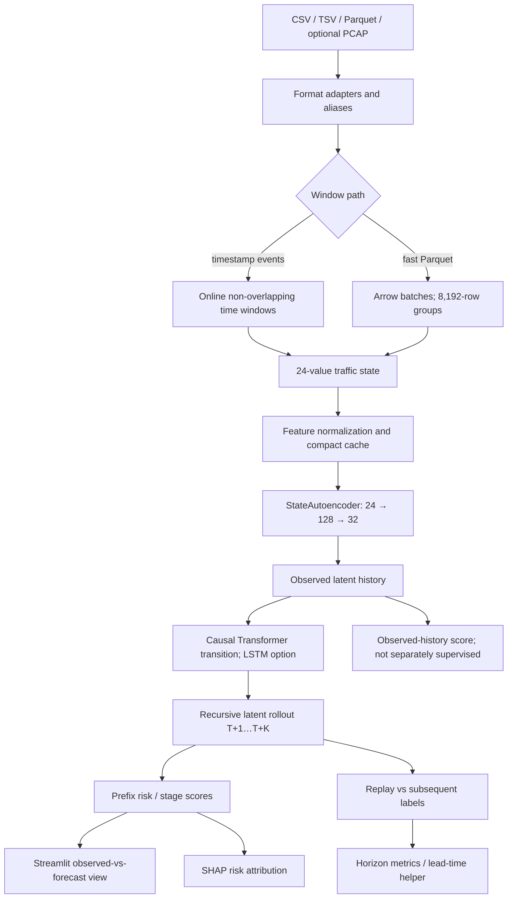

# CyberBat — System Architecture

## 1. Architecture Overview

CyberBat is an offline temporal network-risk forecasting prototype. It maps
traffic windows to 24-value states, encodes history, recursively predicts
future latent states, and scores future risk and stage IDs. The UI also shows
the rollout-trained head applied to observed history as a current score; this
path has no separate current-state supervision or calibration. Forecasts are
predictions, not observed facts or guarantees.

## 2. Architecture Diagram



## 3. Data Flow

CSV/TSV, Parquet, and optional Scapy PCAP adapters produce traffic events.
Generic windows use ordered timestamps (5-second window/stride defaults).
Large-file Parquet preparation projects Arrow batch columns and groups rows
by 8,192 in source order. It writes normalized `float16` features, `int8`
labels and JSON metadata. Row groups are not elapsed real time.

Fast Parquet labels are binary (0/1), so replay stage accuracy is not
six-class ATT&CK accuracy. The generic Parquet adapter has a configurable
category heuristic; fast-cache construction does not preserve it. Missing
features generally become zero.

## 4. Model Architecture

| Component | Implemented structure / output |
|---|---|
| Input | `(batch, sequence, 24)` standardized features. |
| Encoder/decoder | `24 → 128 → GELU → 32`; decoder mirrors to 24. |
| Default transition | `32 → 128`; two causal attention blocks, 4 heads, dropout .1; residual + LayerNorm; FFN `128 → 512 → 128` (GELU/dropout); output `LayerNorm → 32`. No positional embedding. |
| Alternative | Two-layer batch-first LSTM, hidden 128; output `LayerNorm → 32`. |
| Attack head | `32 → 128 → GELU`; max-pool steps; sigmoid risk and six stage logits. |
| Defaults | Latent 32, hidden 128, sequence 12, rollout 5; Adam, LR .001, batch 32, 20 epochs per phase. |

Each step predicts a latent vector, appends it, and drops the oldest history
vector. The attack head scores each predicted prefix. Risk is a sigmoid score,
not calibrated probability; stage labels are not universally verified. Current
score output applies the rollout-trained attack head to observed latent
history, without a separate current-state training objective. Dynamics
pretraining passes the complete encoded history to the transition model and
compares its one-step decoded prediction with the immediately following
feature window. Attack fine-tuning scores each rollout prefix and pairs it
with the binary risk/stage label for that exact future window. Existing
checkpoints without the horizon-supervision marker are not trained this way.

## 5. Temporal Forecasting Mechanism

```text
observed feature history
 → encoder(latent history)
 → displayed observed-history score (no separate current-state supervision)
 → transition(latent history) = ẑ(t+1)
 → append ẑ(t+1); predict ẑ(t+2)
 → repeat K times
 → attack head on each rollout prefix
 → future risk/stage trajectory
```

`src/forecasting.py` replays deterministic origins against labels at
`origin + horizon`; missing labels are excluded per horizon. The current
UNSW-NB15 cache is row ordered, lacks timestamps and has binary labels, so its
replay can only be described as row-order label comparison—not validated
chronological forecasting, stage validation, or early-warning performance.
Lead time requires chronological timestamped windows and sequential labels;
the local UNSW lead-time result is unavailable. Existing checkpoints without
the `horizon_aligned_rollout_prefixes_v1` marker predate horizon-aligned
attack supervision; their later-horizon scores are exploratory.

## 6. Data Engineering

- Formats: CSV/TSV, Parquet/PQ, PCAP/PCAPNG adapter (Scapy optional).
- Parquet batches use selected columns/NumPy arrays; generic windows use
  online statistics and bounded samples; streaming requires non-overlap.
- Cache: memory-mappable normalized `float16` features and `int8` labels.
- Upload, evaluation and replay may materialize arrays; multi-GB model
  evaluation is not demonstrated.
- Cache metadata does not version window semantics. Existing caches differ
  from current 8,192-row Parquet grouping; preserve exact artifacts.

## 7. Explainability & Evaluation

SHAP `Explainer` attributes the local forecast-risk function to normalized
features using an independent masker. Attribution is not causality; attention
is not exposed as a validated explanation.

`evaluate.py` can report precision/recall/F1/FPR, ROC-AUC/PR-AUC where
available, confusion counts and a logistic current-window baseline. It uses
the checkpoint training normalizer for both train and test data. The available
UNSW test source currently produces too few windows for the configured
12-window history and next-window target, so no held-out metrics are
available. The saved UNSW replay uses 1,000 origins from a cache without
verified temporal order; binary cache labels do not validate six-class
ATT&CK accuracy, and the local checkpoint predates horizon-aligned attack
supervision. Previously cited evaluation and lead-time values have been
withdrawn as invalid for those claims.

## 8. Technology Stack

Python; PyTorch; NumPy; PyArrow; scikit-learn; Streamlit; Plotly; SHAP;
Scapy (optional); Python standard-library CSV/JSON/path utilities.

## 9. Security / Reliability Boundaries

- **Forecast ≠ fact:** no compromise proof or guaranteed future event.
- **Attribution ≠ causality:** SHAP indicates model contribution only.
- **MITRE-aligned ≠ verified:** mappings may be heuristic; fast labels binary.
- **Prototype ≠ SOC:** no attacker identification, endpoint telemetry,
  live interface capture, continuous monitoring, decryption, automatic
  response, or analyst replacement.
- **Timing/generalization:** row-order is not wall time; labels, cache drift,
  and evaluation limits preclude production claims.
